# Cybersecurity Base 2020 / 2021 CTF

## 1. Steganography I

> *You see a large wolf as you are crossing a field. Can you figure out her [name](01_Steganography_I/doggy.jpg)?*

The description given for this exercise only links to the following `jpg` file:

To solve this exercise I have used the [stegsolve](https://github.com/eugenekolo/sec-tools/tree/master/stego/stegsolve/stegsolve) tool, which I started with the command:

    java -jar stegsolve.jar

I opened the File format report (`Analyze > File Format`), where I found the flag (LilSif) under the ascii dump of data:

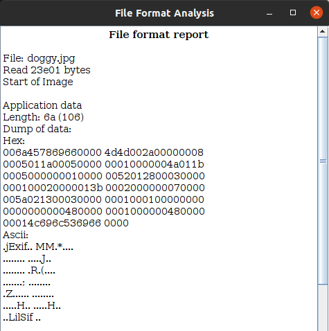

## 2. Steganography II

> *More secrets in the [image](02_Steganography_II/bamboozled.jpg). Can you find it?*

The description given for this exercise only links to the following `jpg` file:

To solve this challenge I used again [stegsolve](https://github.com/eugenekolo/sec-tools/tree/master/stego/stegsolve/stegsolve).
Again, I opened the File format report (`Analyze > File Format`), where I found some additional data appended to the file:

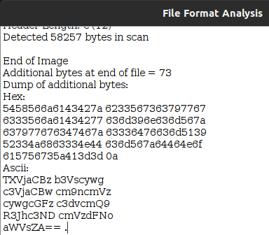

By decoding the ascii string with an [online base64 decoder](https://www.base64decode.org), I was able to capture get the flag:

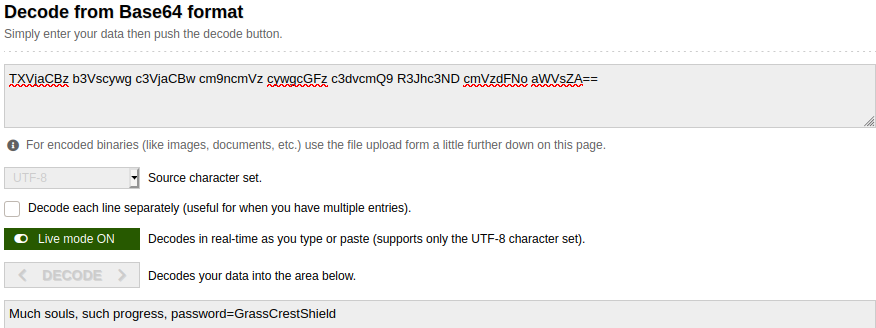

## 3. Dr. Strangelove

> *You have lost your key to Dr. Strangelove software and he is refusing to help you since he believes that those who are foolish enough to lose their keys don't deserve to use his products. Dr. Strangelove has suggested that you try to figure out what your key was. You can use his key validation service that is available [here](https://csb-capture-the-flag.cs.helsinki.fi/challenge-files/sites/strangelove/).*

The description redirects to this website:

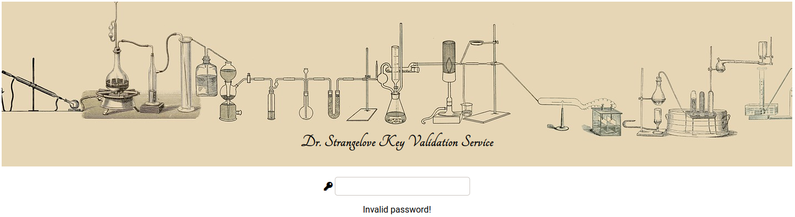

By viewing the source code of the webpage I saw the only JavaScript file was `test.js`, in which I found the password, hidden in plain sight:

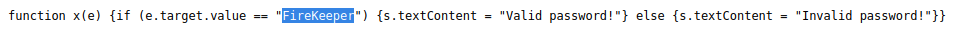

## 4. Cyber monkeys

> *A troop of cyber monkeys decided to start a security consultancy. They claim that they invented a new unbreakable encryption scheme. Can you break the code: Jub xrrc fgrnyvat bhe onananf? Jr obhtug n arj fnsr naq gur cnffjbeq vf ZbaxrlObbmr.*

For capturing this flag I used an [online Caesar cipher encoder and decoder](https://cryptii.com/pipes/caesar-cipher) to decipher the given string:

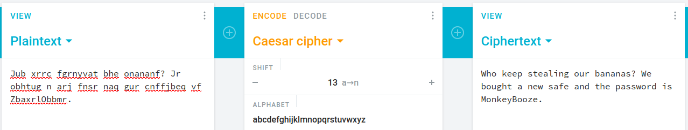

## 5. Emma's secret
## 6. Password checker

> *A merchant named Oswald has forgotten password for his proprietary [software](06_Password_checker/register). Can you help him out?*

The description provides us with a binary file.
By analyzing this with an [online file viewer tool](https://www.percederberg.net/tools/file_info.html), I was able to get the flag:

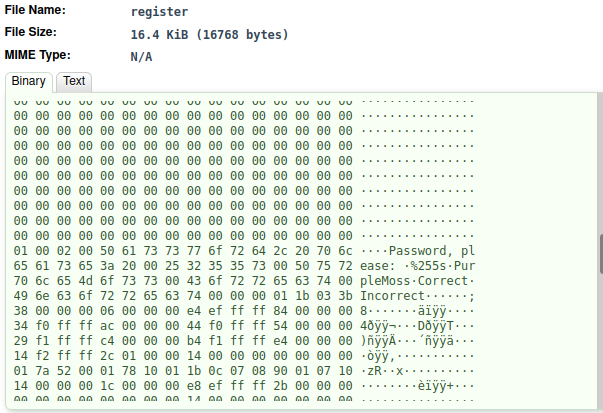

## 7. DiamondHands Bank I
## 8. Two time pad

> *A shady man named Patches sends a message to Petrus using XOR and a one-time pad. You find out that the plain text message 'riches' encrypted is 'vjeomr'. Patches being stingy sends a new message 'glqfze' and reuses the pad. Decrypt the message.*

To solve this challenge I used and [online XOR calculator](http://xor.pw/), since the description explicitly says *using XOR and a one-time pad*.

First, I extracted the the pad by calculating the XOR between the cleartext and the encrypted string.

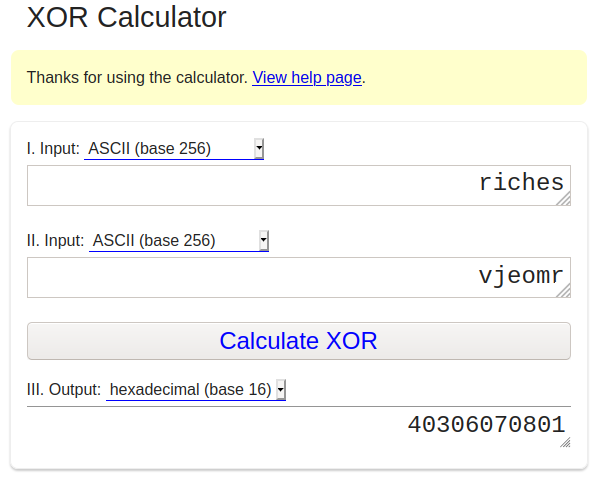

Then, I got the cleartext of the second string by calculating the XOR between the previous result and the encrypted string:

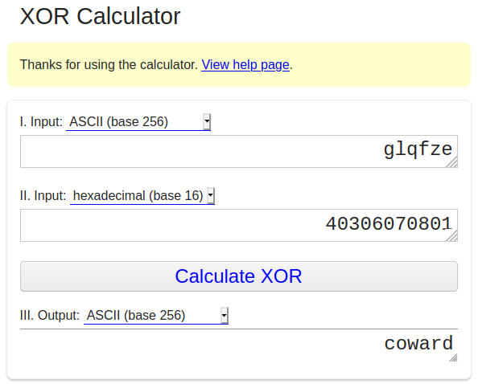

## 9. DiamondHands Bank II
## 10. Logs logs logs

> *A merchant asked you to find any leaks in his web site. You noticed that the developer wrote ...< form > < input type=text name=passwd >... So to prove a point you started searching the [logs](10_Logs_logs_logs/logs.zip).*

The zip file provided by the description contains `acunetix.txt`.
In here there are the the logs of a web server.
Since the description mentions the passworkd is passed as a `type=text` variable in the URL, it can be found by searching *`passwd=`* in the file.

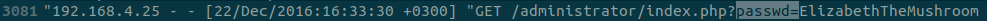

## 11. Password II

> *The merchant that you helped has a friend that also needs [help](11_Password_II/counter). Can you help him?*

The description provides a [counter](11_Password_II/counter) file.
By using the same binary file analyzer from challenge 6, I was able to find the password hardcoded in the file:

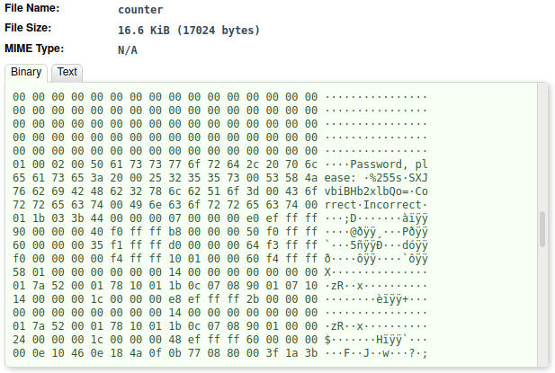

This is a base64 encoded string, thus to decode it and get the flag, I used the same decoder from challenge 2:

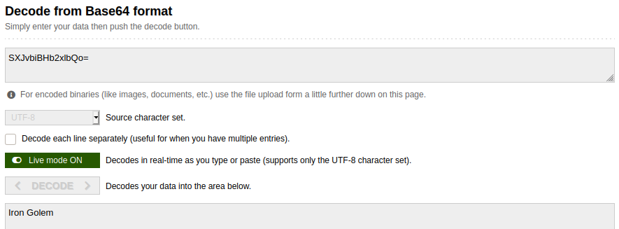

## 12. Monkeys are back

> *Our cyber monkeys try to be clever and invented a better scheme for encryption. Or did they? Can you prove them wrong? 
> Ciphertext: 'WWR5IHRqcCBuenogb2N6IGJwdCByZG9jIHYgcmpqeXppIHZtaA=='*

Compared to the string given in challenge 4, this is a base64 encrypted string, so again I pasted the string in the online decoder from the previous challenges.

This gave me a string which reminded me of the previously used cipher used by the monkeys.
So I fed the string to the same Caesar cipher decoder to get the plaintext:

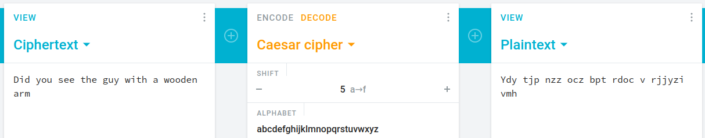

## 13. Dr. Strangelove Mk II
## 14. Dawn of the monkeys

> *The cyber monkeys are hoarding bananas and planning something. You intercept their email. Can you figure out access to the stash?*

This was a particularly fun challenge to solve.
At first, I tried to decipher the email with the usual Caesar cipher decoder, but, as expected, it did not work.
Thus I thought the monkyes could have used a substitution cipher, thus I fed the given email in an [online alphabet substitution decoder](https://www.dcode.fr/monoalphabetic-substitution).

By playing around and starting to decode the usual words used in an email, such as *From*, *To*, *dear*, I found the plaintext:

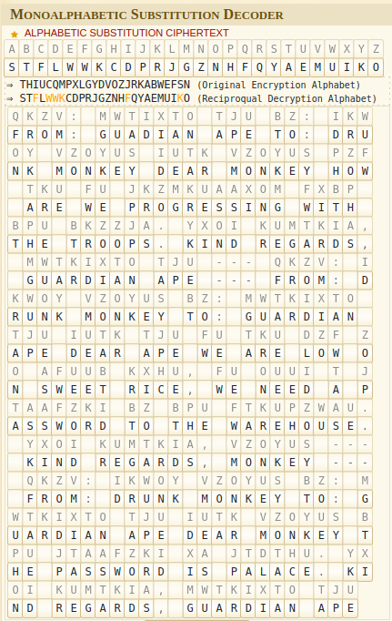

## 15. Lazy passwords
## 16. Password III
## 17. Rise of the monkeys

> *Cyber monkeys decided to change to military-grade encryption, and hashed their password to PLOJAINTZOCVIQIVAJSQVEKNND. Luckily, you got access to their [encrypter](17_Rise_of_the_monkeys/encrypter). Can you figure out the password? Hint: monkeys do like to SHOUT.*

Again, since the description has given us a file, I used the binary file analyzer from before to learn something more about it.

Going through this file as binary did not give me any information about the flag, but I saw that it is an output of GCC, the *GNU Compiler Collection*.
Thus it is an executable built from cpp.

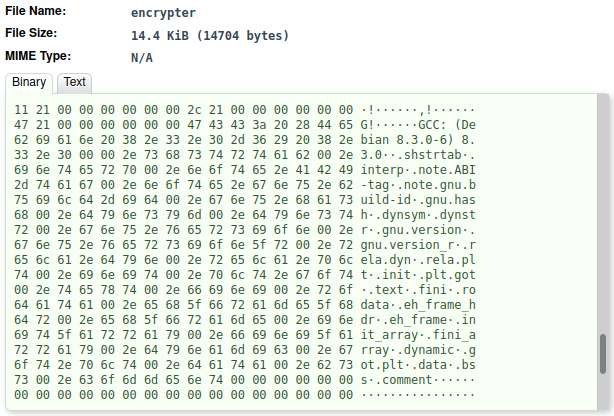

I added the `.o` extension to the file and made it executable, and then I tested it:

    mv encrypter encrypter.o
    chmod +x *.o
    ./encrypter.o

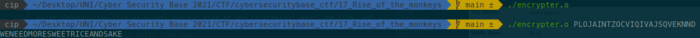

Without any arguments the script did not return anything, but by passing it the string given in the description, it revealed its secrets.

## 18. Cyber crime does pay
## 19. Dr. Strangelove strikes back!
## 20. Steganography III
## 21. Password IV
## 22. Country roads

# Personal considerations