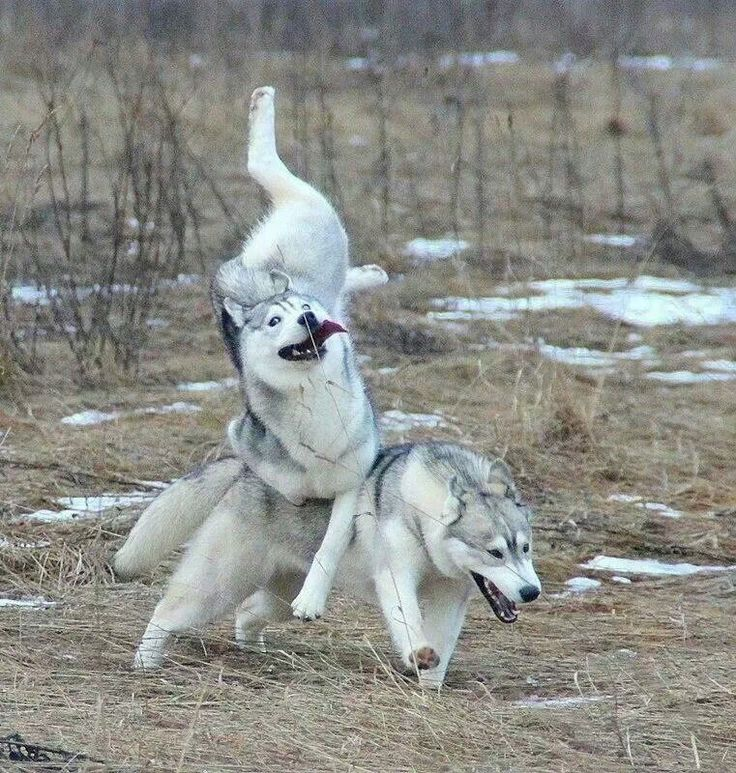

# Cybersecurity Base 2020 / 2021 CTF

## Easy challenges

### 01 Steganography I

> *You see a large wolf as you are crossing a field. Can you figure out her [name](!01_Steganography_I/doggy.jpg)?*

The description given for this exercise only links to the following jpg file:

To solve this exercise I have used the [stegsolve](https://github.com/eugenekolo/sec-tools/tree/master/stego/stegsolve/stegsolve) tool, which I started with the command:

    java -jar stegsolve.jar

I opened the File format report (`Analyze > File Format`), where I found the flag (LilSif) under the ascii dump of data:

### 02 Steganography II
### 03 Dr. Strangelove
### 04 Cyber monkeys
### 05 Emma's secret
### 06 Password checker
### 07 DiamondHands Bank I
### 08 Two time pad
### 09 DiamondHands Bank II
### 10 Logs logs logs

## Medium challenges

### 11 Password II
### 12 Monkeys are back
### 13 Dr. Strangelove Mk II
### 14 Dawn of the monkeys
### 15 Lazy passwords
### 16 Password III
### 17 Rise of the monkeys
### 18 Cyber crime does pay
### 19 Dr. Strangelove strikes back!

## Hard challenges

### 20 Steganography III
### 21 Password IV
### 22 Country roads