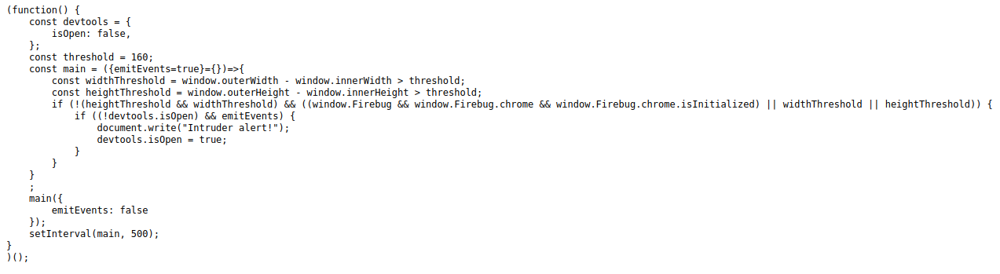

# Cybersecurity Base 2020 / 2021 CTF solutions

This repository contains the solutions and explanations of the CTF of the [Cyber Security Base 2021](https://cybersecuritybase.mooc.fi/) course at the University of Helsinki.

- [Cybersecurity Base 2020 / 2021 CTF solutions](#cybersecurity-base-2020--2021-ctf-solutions)
  - [1. Steganography I](#1-steganography-i)
  - [2. Steganography II](#2-steganography-ii)
  - [3. Dr. Strangelove](#3-dr-strangelove)
  - [4. Cyber monkeys](#4-cyber-monkeys)
  - [5. Emma's secret](#5-emmas-secret)
  - [6. Password checker](#6-password-checker)
  - [7. DiamondHands Bank I](#7-diamondhands-bank-i)
  - [8. Two time pad](#8-two-time-pad)
  - [9. DiamondHands Bank II](#9-diamondhands-bank-ii)
  - [10. Logs logs logs](#10-logs-logs-logs)
  - [11. Password II](#11-password-ii)
  - [12. Monkeys are back](#12-monkeys-are-back)
  - [13. Dr. Strangelove Mk II](#13-dr-strangelove-mk-ii)
  - [14. Dawn of the monkeys](#14-dawn-of-the-monkeys)
  - [15. Lazy passwords](#15-lazy-passwords)
  - [16. Password III](#16-password-iii)
  - [17. Rise of the monkeys](#17-rise-of-the-monkeys)
  - [18. Cyber crime does pay](#18-cyber-crime-does-pay)
  - [19. Dr. Strangelove strikes back!](#19-dr-strangelove-strikes-back)
  - [20. Steganography III](#20-steganography-iii)
  - [21. Password IV](#21-password-iv)
  - [22. Country roads](#22-country-roads)
- [Personal considerations](#personal-considerations)

## 1. Steganography I

> *You see a large wolf as you are crossing a field. Can you figure out her [name](01_Steganography_I/doggy.jpg)?*

The description given for this exercise only links to the following `jpg` file:


To solve this exercise I have used the [stegsolve](https://github.com/eugenekolo/sec-tools/tree/master/stego/stegsolve/stegsolve) tool, which I started with the command:

    java -jar stegsolve.jar

I opened the File format report (`Analyze > File Format`), where I found the flag (LilSif) under the ascii dump of data:


## 2. Steganography II

> *More secrets in the [image](02_Steganography_II/bamboozled.jpg). Can you find it?*

The description given for this exercise only links to the following `jpg` file:


To solve this challenge I used again [stegsolve](https://github.com/eugenekolo/sec-tools/tree/master/stego/stegsolve/stegsolve).
Again, I opened the File format report (`Analyze > File Format`), where I found some additional data appended to the file:


By decoding the ascii string with an [online base64 decoder](https://www.base64decode.org), I was able to capture get the flag:


## 3. Dr. Strangelove

> *You have lost your key to Dr. Strangelove software and he is refusing to help you since he believes that those who are foolish enough to lose their keys don't deserve to use his products. Dr. Strangelove has suggested that you try to figure out what your key was. You can use his key validation service that is available [here](https://csb-capture-the-flag.cs.helsinki.fi/challenge-files/sites/strangelove/).*

The description redirects to this website:


By viewing the source code of the webpage I saw the only JavaScript file was `test.js`, in which I found the password, hidden in plain sight:


## 4. Cyber monkeys

> *A troop of cyber monkeys decided to start a security consultancy. They claim that they invented a new unbreakable encryption scheme. Can you break the code: Jub xrrc fgrnyvat bhe onananf? Jr obhtug n arj fnsr naq gur cnffjbeq vf ZbaxrlObbmr.*

For capturing this flag I used an [online Caesar cipher encoder and decoder](https://cryptii.com/pipes/caesar-cipher) to decipher the given string:


## 5. Emma's secret

> *Emma has chosen two primes p=19 and q=23 for her RSA modulus n, and a public key e=7. She receives a cipher 42 that has been encrypted with her public key. What is the plaintext?*

For solving this challenge I applied the [mathematical formulas related to the RSA algorithm](https://www.di-mgt.com.au/rsa_alg.html):

```
p = 19
q = 23
N = p*q = 437
r = (p-1)*(q-1) = 396
```

To decrypt the ciphertext 42 (`m = 42`) given in the description, I applied the formula `m = c^d mod N`, where `d` is calculated as:

```
ed = 1 mod r
7*d = 1 mod 396
```

Thus the value of `d` that satisfies the equation is `d = 283`.

To get the flag `m` and solve the challenge I solved the following equation with the use of an [online modulus calculator](https://www.mtholyoke.edu/courses/quenell/s2003/ma139/js/powermod.html):

```
m = c^d mod N
m = 42^283 mod 437
m = 313
```


## 6. Password checker

> *A merchant named Oswald has forgotten password for his proprietary [software](06_Password_checker/register). Can you help him out?*

The description provides us with a binary file.
By analyzing this with an [online file viewer tool](https://www.percederberg.net/tools/file_info.html), I was able to get the flag:


## 7. DiamondHands Bank I

> *Rumour has it that [DiamondHands Bank](https://csb-diamond-bank.cs.helsinki.fi/), has a secret admin panel containing top secret information. Your client wants you to find it and to 'obtain' its secrets. The panel supposedly leaked previously when a popular search engine accidentally indexed it. However, security has been tightened since then.*

The link in the description redirected me to the website of a fake bank in which I accessed with my university credentials.


Here there was nothing strange, the first thing that I could see was the balance, which was useless for the scope of this challenge.


The other pages were not useful as well since they did not give any particular information on what the flag was, neither contained bugs in the code.

I tried searching for the hidden page on Google, Bing and DuckDuckGo, but none had any information about it.

After confronting with other students, I discovered a hidden link in the [`robots.txt`](https://csb-diamond-bank.cs.helsinki.fi/robots.txt) file of the website.


In this secret panel there is the password for the database.


## 8. Two time pad

> *A shady man named Patches sends a message to Petrus using XOR and a one-time pad. You find out that the plain text message 'riches' encrypted is 'vjeomr'. Patches being stingy sends a new message 'glqfze' and reuses the pad. Decrypt the message.*

To solve this challenge I used and [online XOR calculator](http://xor.pw/), since the description explicitly says *using XOR and a one-time pad*.

First, I extracted the the pad by calculating the XOR between the cleartext and the encrypted string.


Then, I got the cleartext of the second string by calculating the XOR between the previous result and the encrypted string:


## 9. DiamondHands Bank II

> *[DiamondHands Bank](https://csb-diamond-bank.cs.helsinki.fi/) should have a hidden debugging mode in their Javascript code which should leak their secret backend key. Can you find it?*

The website given in the description is the same from challenge 7.
By checking the source code of the website, I found the JavaScript mentioned in the description.
Even if it is minified I searched for the word *debugging*, which led me to this:


So I pasted the link to the json file to the root of the URL, which led me to get the flag:


## 10. Logs logs logs

> *A merchant asked you to find any leaks in his web site. You noticed that the developer wrote ...< form > < input type=text name=passwd >... So to prove a point you started searching the [logs](10_Logs_logs_logs/logs.zip).*

The zip file provided by the description contains `acunetix.txt`.
In here there are the the logs of a web server.
Since the description mentions the passworkd is passed as a `type=text` variable in the URL, it can be found by searching *`passwd=`* in the file.


## 11. Password II

> *The merchant that you helped has a friend that also needs [help](11_Password_II/counter). Can you help him?*

The description provides a [counter](11_Password_II/counter) file.
By using the same binary file analyzer from challenge 6, I was able to find the password hardcoded in the file:


This is a base64 encoded string, thus to decode it and get the flag, I used the same decoder from challenge 2:


## 12. Monkeys are back

> *Our cyber monkeys try to be clever and invented a better scheme for encryption. Or did they? Can you prove them wrong? 
> Ciphertext: 'WWR5IHRqcCBuenogb2N6IGJwdCByZG9jIHYgcmpqeXppIHZtaA=='*

Compared to the string given in challenge 4, this is a base64 encrypted string, so again I pasted the string in the online decoder from the previous challenges.


This gave me a string which reminded me of the previously used cipher used by the monkeys.
So I fed the string to the same Caesar cipher decoder to get the plaintext:


## 13. Dr. Strangelove Mk II

> *Dr. Strangelove is furious that you have cracked his key [service](https://csb-capture-the-flag.cs.helsinki.fi/challenge-files/sites/strangelove-returns/)! He has changed all of his keys and made a new validation service. Regain access. Firefox has problems with this puzzle, use Chrome instead.*

As per the other challenges regarding this website, I first opened the JavaScript file with all the code.
After looking around I found out that it was a simulator of the Enigma machine and that the array `r[]` represented the position of the rotors.

Since I couldn't make out anything from the unminified code I printed all the JavaScript variables from the console in Chome with:

```JavaScript
for(var b in window) { 
    if(window.hasOwnProperty(b)) console.log(b); 
}
```

With the help of one of my german speaking friends I, figured out that the word *kodieren* stands for *codec* and I took a look at what this function does:


The subtractions didn't make a lot of sense since the varible `wout` is an array of 4 times 65:


Thus the solution can be found by printing the variable `t`:


## 14. Dawn of the monkeys

> *The cyber monkeys are hoarding bananas and planning something. You intercept their [email](14_Dawn_of_the_monkeys/monkey_business.txt). Can you figure out access to the stash?*

This was a particularly fun challenge to solve.
At first, I tried to decipher the email with the usual Caesar cipher decoder, but, as expected, it did not work.
Thus I thought the monkyes could have used a substitution cipher, thus I fed the given email in an [online alphabet substitution decoder](https://www.dcode.fr/monoalphabetic-substitution).

By playing around and starting to decode the usual words used in an email, such as *From*, *To*, *dear*, I found the plaintext:


## 15. Lazy passwords

> *Gough Hawkeye's password is 'Kalameet2020' with a secure hash of '75784efcbe9cbd25aa0da913914640c2b2d1b2216979773e15e241703eef099d544ca120d8934b8d5112168866e28daf1a0f1bed01316fb0e222fea8204bb56b'. Gough decided to change his password but only changed the number. The new hash is '37ca33a0987bca0661504cd4ceba4989a048437d94df4b59170bbd5c00dba9ba0319afc61fd7bfd8343882ea9fd604804d3669a03d70a0fe02a6d6a9bd32bb15'. Can you figure out the new password?*

At first for this challenge I had to understand the type of encryption used.
Thus I did some tests with this [online encryption tool](), with which I understood that the encryption used is SHA512.


Since I did not get any good result by changing the numeric part from 2020 to 2021 or 2019, instead of manually trying the possible combinations I wrote a [python script](15_Lazy_passwords/guesser.py) that would do that for me.

```python
import hashlib

text = "Kalameet"

for i in range(1900, 2050):
    tmp = hashlib.sha512(bytes(text + str(i), 'utf-8')).hexdigest()
    if str(tmp) == "37ca33a0987bca0661504cd4ceba4989a048437d94df4b59170bbd5c00dba9ba0319afc61fd7bfd8343882ea9fd604804d3669a03d70a0fe02a6d6a9bd32bb15":
        print(text + str(i))
        exit()
```
This testes the various number combinations and outputs when the encrypyed text + number are equal to the string given in the description.


## 16. Password III

> *A [program](16_Password_III/giftbox) written in C is given to you by the local carpenter. It uses a known library with a type declaration 'struct state { char input[2048]; int debug; };'. Can you find the secret?*

Here the description has given a compiled C program file without extension.
Thus, in order to execute it I added `.o` at the end of its name and tested it.

```
mv encrypter encrypter.o
chmod +x *.o
./encrypter.o
```

The program did nothing away and it only ouputed the given string.


Since the description gives away the fact that there is a struct with a *`char input[2048];`* immediately followed by an *`int debug;`*, I thought I could do a buffer overflow attack against the program.
I then used python to print more than 2048 chars, that have been given in input to the program, which finally revealed the flag.


## 17. Rise of the monkeys

> *Cyber monkeys decided to change to military-grade encryption, and hashed their password to PLOJAINTZOCVIQIVAJSQVEKNND. Luckily, you got access to their [encrypter](17_Rise_of_the_monkeys/encrypter). Can you figure out the password? Hint: monkeys do like to SHOUT.*

Again, since the description has given us a file, I used the binary file analyzer from before to learn something more about it.

Going through this file as binary did not give me any information about the flag, but I saw that it is an output of GCC, the *GNU Compiler Collection*.
Thus it is an executable built from cpp.


I added the `.o` extension to the file and made it executable, and then I tested it:

```
mv encrypter encrypter.o
chmod +x *.o
./encrypter.o
```


Without any arguments the script did not return anything, but by passing it the string given in the description, it revealed its secrets.

## 18. Cyber crime does pay

> *The marketplace in [DiamondHands Bank](https://csb-diamond-bank.cs.helsinki.fi/) has information for sale that your 'friend' requires. Sadly, you lack the necessary funds to acquire this information. Use your hacking skills to obtain more currency and obtain the information.*

This time the challenge requires buying the bank owner's password from the marketplace.


Since there are no visible flaws in the code and the checks on the exchanged amounts are done in the back end I had to automatize the conversion in order to gain the money and avoid doing it manually.
For that I created a simple JS script that I fed to the [Custom JavaScript](https://chrome.google.com/webstore/detail/custom-javascript-for-webpoakhlngfciodnhlhhgnaaelnpjljija) plugin for Chrome.

```JavaScript
var balance = document.getElementsByClassName("card-block")[0].children[1].textContent
var balance_split = balance.split(" ")

var euros = balance_split[2]
var cyber = balance_split[balance_split.length-4]


if (euros >= 4){

    document.getElementById("amount_").value = 4;

} else {

    document.getElementById("conversion").value="cyber_to_euros";
    document.getElementById("amount_").value = cyber;
    
}

document.getElementsByClassName("btn btn-primary")[1].click();	
```

I converted 4 euros instead of all the amount at the same time since it allowed me to maximize the amount of cybermoney gained when checking the decimal points.

This simple code automates the conversion process by checking if I have enough euros to convert in cyber money, if true then I convert euros in cyber coins, otherwise I convert all cybercoins back to euros.

In this way I was able to gain enough money to buy the key from the marketplace page.


## 19. Dr. Strangelove strikes back!

> *Impressive... most impressive. You have successfully cracked all previous Dr. Strangelove key validators. But now he has a brand new site with anti-cheating technology to make your job harder. Can you still crack [it](https://csb-capture-the-flag.cs.helsinki.fi/challenge-files/sites/strangelove-world/)?*

The description redirects to the final level of the Dr. Strangelove challenges.
When opened full screen on the browser, the website shows an `Intruder alert!` error.
By opening the `test.js` file, I noticed the last function that prevented showing the contents of the website if the developer tools are open and if the window dimensions don't fall in a certain parameter.



Thus I reopened the site in a smaller window and only afterwards I opened the console and made the window bigger.

I couldn't find any useful hint by parsing the JavaScript file, so I decided to print again the loaded variables in the console and follow them back.

```JavaScript
for(var b in window) { 
    if(window.hasOwnProperty(b)) console.log(b); 
}
```

I couldn't find the declaration of the variable `wup` so I decided to print it and understand it better.


This is a function that apparently contains the plaintext password, which is the flag.
Upon further inspection `wup` is a function contained in `e`:

```JavaScript
var f = document.querySelector('input');
var s = document.getElementById('status');
function wup(e) {if (e.target.value == "SaintIsshin") {s.textContent = "Valid password!"} else {s.textContent = "Invalid password!"}}
f.addEventListener('input', wup);
```

This is an external JavaScript file loaded by the line of code `$.getScript("e");`.

## 20. Steganography III

> *Something is hidden in the [image](20_Steganography_III/exhausted.jpg). Can you find it?*


I believe that this challenge was particularly fun as well.
The description provided an image that, after opening with the tool used in the previous steganography challenges, I discovered had some additional data appended to it.


From the first bytes and the equivalent ascii code, I understood that there was a `.rar` file appended to the image.
After checking some hex to bin online tools that did not work correctly I ended up uzing [7zip](https://www.7-zip.org/) to extract the files contained in the appended zip.
This revealed a `passwd.txt` file that contained the flag.


## 21. Password IV
## 22. Country roads

# Personal considerations